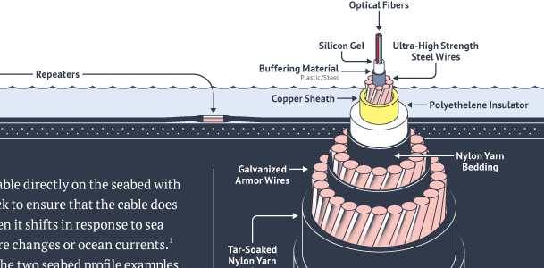
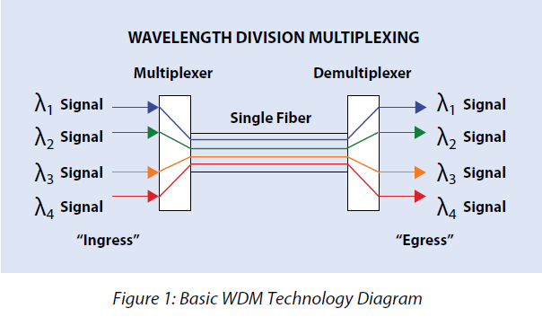
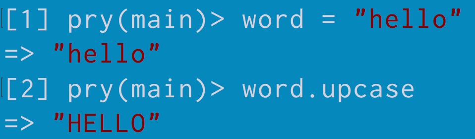
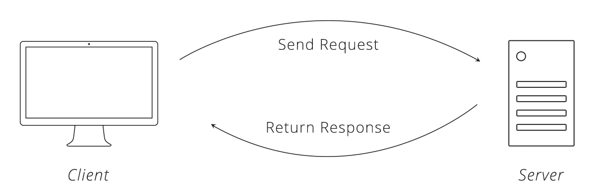

#The Internet Demystified

By the end of this talk you will be able to:

* Explain at a high level how the Internet works
* Distinguish between the Internet and the World Wide Web
* Understand why HTML CSS and JavaScript work together so well
* Articulate what an API is

##The Internet

<details>
    <summary>How did the Internet begin?</summary>
    <figure>
        <h3>The First Internet Communication</h3>
        
        <figcaption>"Lo" and behold, the first Internet communication was sent over a network of computers called the ARPANET from UCLA to Stanford.</figcaption>
    </figure>
</details>

<details>
    <summary>How does data travel through the internet?</summary>
    <figure>
        <h3>Data Packets</h3>
        
        <figcaption>Any data you send over the Internet is split up into data packets. Each packet is routed to the destination eventually, but may all take different paths to get there.</figcaption>
    </figure>
</details>

<details>
    <summary>How is the network structured?</summary>
    <figure>
        <h3>Major Nodes in the Network</h3>
        
        <figcaption>The Internet is a global network of networks connected through a set of Internet exchange points</figcaption>
    </figure>
</details>

<details>
    <summary>What does a connection look like?</summary>
    <figure>
        <h3>Undersea Internet Cable</h3>
        
        <figcaption>All data transmitted across the Internet is eventually communicated through a fiber optic cable as flashes of light.</figcaption>
    </figure>
</details>

<details>
    <summary>How does all that data flow through one cable?</summary>
    <figure>
        <h3>Multiplexing</h3>
        
        <figcaption>Multiplexing allows multiple data streams to be share one wire by splitting each stream into a separate channel with a different bandwidth.</figcaption>
    </figure>
</details>

<details>
    <summary>What does TCP/IP mean?</summary>
    <figure>
        <h3>It's part of the Internet Protocol Suite</h3>
        
        <figcaption>The Internet connects computers together using a suite of predefined protocols that makeup the Internet Protocol Suite. TCP/IP stands for Transmission Control Protocol/Internet Protocol. TCP is the protocol that ensures the data sent is reliable, ordered, and error-checked. IP is the protocol concerned with routing the data grams  through the network efficiently.</figcaption>
    </figure>
</details>


##The World Wide Web

<details>
    <summary>How does the World Wide Web compare to the Internet?</summary>
    <figure>
        <h3>World Wide Web vs The Internet</h3>
        
        <figcaption>The Internet is the actual network that connects computers together and encompasses a wide range of protocols. The World Wide Web only represents a specific protocol on the Application layer of the Internet Protocol Suite.</figcaption>
    </figure>
</details>

<details>
    <summary>What protocol does the WWW use to communicate?</summary>
    <figure>
        <h3>HTTP</h3>
        
        <figcaption>HTTP is a protocol on the application layer that the World Wide Web uses to communicate. It is responsible for delivering HyperText files and applications. More specifically, browsers rendering HTML files will use the WWW.</figcaption>
    </figure>
</details>

<details>
    <summary>Who invented the World Wide Web?</summary>
    <figure>
        <h3>Tim Berners Lee</h3>
        
        <figcaption>Tim devised a system for sharing HyperText documents while at CERN. During the late 80s and early 90s he specified the first versions of HTML and HTTP that ended up birthing the World Wide Web and changing the usability of the Internet forever.</figcaption>
    </figure>
</details>

<details>
    <summary>What is HyperText?</summary>
    <figure>
        <h3>The Mother of All Demos</h3>
        
        <figcaption>In the '60s Douglas Engelbart demonstrated a machine that was capable of rich media, collaborative text editing, and teleconferencing. Now HTML, aka HyperText Markup Language, enables anyone to design rich media documents that are literally "beyond" (hyper) text.</figcaption>
    </figure>
</details>

<details>
    <summary>Who is in charge of the WWW?</summary>
    <figure>
        <h3>W3C</h3>
        
        <figcaption>The Technical Architecture Group meets regularly to discuss, document, and build Web standards. This group consists of 9 participants, some from outside organizations like Microsoft, Google, and Mozilla. They are known as the World Wide Web Consortium or W3C.</figcaption>
    </figure>
</details>

<details>
    <summary>So how does HTML relate to CSS and Javascript?</summary>
    <figure>
        <h3>CSS & JS Endow Style and Behavior to HTML</h3>
        
        <figcaption>You can think of HTML CSS and JS as the three major parts of speech in human language: nouns, adjectives, and verbs. HTML is the noun as it is in charge of organizing content (text, photos, videos, audio, links, etc) into a file. CSS is the adjective as it is entirely concerned with the visualization of the content. JavaScript is the verb as it can add behavior and dynamism to the content.</figcaption>
    </figure>
</details>

##APIs

<details>
    <summary>What is the definition of an API</summary>
    <figure>
        <h3>Application Programming Interface</h3>
        
        <figcaption>An API is simply the interface for how one interacts with a piece of software. In programming a string of characters, such as `"hello"`, is refered to as a String. From the above example, we see that `.upcase` is part of a String's API.</figcaption>
    </figure>
</details>

<details>
    <summary>Can you give me a real world example of one?</summary>
    <figure>
        <h3>A Restaurant</h3>
        
        <figcaption>The purpose of a restaurant is to abstract the effort of making food away from the client. A restaurant's menu represents their API. The server waits on a client for a request. When ordering, the client references the restaurant's API, the menu, to send a specific, predefined request to the server. When the server delivers the dish back to the client's table, the request is completed with a response (more on the request/response cycle later).</figcaption>
    </figure>
</details>

<details>
    <summary>When we talk about Twitter's API, what does that mean?</summary>
    <figure>
        <h3>An Interface to Twitter's Data</h3>
        
        <figcaption>Developers may want a way to access Twitter's data, so Twitter exposes an interface for them to do so. Big companies exposing their data over the internet is an extremely simplified idea of what an API is. Litterally every piece of software, at some level, has an interface to access it!</figcaption>
    </figure>
</details>

<details>
    <summary>How could we interact with a third party's web API?</summary>
    <figure>
        <h3>The Request/Response Cycle</h3>
        
        <figcaption>Every time you visit a webpage your computer is acting as a client that will send a request to a URL. This URL maps to a specific server somewhere else in the world. That server is tasked with responding back to you with the information you have requested. Each request must contain two things: a URL (also refered to as a path or end point) and an HTTP verb. The verb options are: GET, POST, PUT, and DELETE, which mean you want to read, create, edit, or delete some data at a specific end point.</figcaption>
    </figure>
</details>

<details>
    <summary>How could we make a "Hello World" API using Node?</summary>
    <figure>
        <h3>Hello World API in Node</h3>
        
```js
//Lets require/import the HTTP module
var http = require('http');

//Lets define a port we want to listen to
const PORT=8080; 

//We need a function which handles requests and send response
function handleRequest(request, response){
    response.end('Hello World');
}

//Create a server
var server = http.createServer(handleRequest);

//Lets start our server
server.listen(PORT, function(){
    //Callback triggered when server is successfully listening. Hurray!
    console.log("Server listening on port", PORT);
});
```
</details>


##Q & A

<details>
    <summary>Summary</summary>
    <figure>
        <h3>Internet Demystified!</h3>
        
        <figcaption>There's more marketing jargon and acronyms in the world than ever before. All the concepts are very abstract as software is not tangible. Understanding these basic building blocks of modern web technologies will help you communicate with technical people and independently learn new technical concepts.</figcaption>
    </figure>
    <h3>Contact</h3>
    <ul>
        <li>Twitter: @iTsangaris</li>
        <li>Github: iliastsangaris</li>
        <li>Email: ilias@ga.co</li>
    </ul>
</details>
